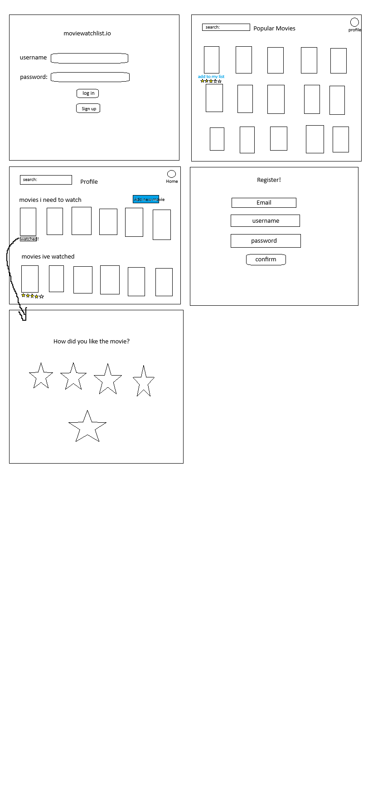

# Project-2-Movie-Planner

# Project Description 
Our Movie Review and Watchlist Application is a web-based platform developed using Express, MongoDB, Mongoose, Node, EJS, and JavaScript. It provides users with the ability to create an account, save their data, add movie reviews, maintain a watchlist, and contribute custom movie information. This application caters to movie enthusiasts who want a centralized place to manage their movie-related activities.

# Picture of home page 

# User Stories 
-As the user I would like to create an account to keep my data saved with all my changes

-As the user I want to be able to add a review for movies I have watched 

-As a user I want to be able to add a movies I would like to watch

-As the user I want to be able to add my own movie title and author

-in case the movie I watched or want to watch is not present in the database 

# MVP + Stretch Goals 
### MVP Goals
A home page with full access to a list of movies the user added to his to-watch list and movies he has already watched
-For the movies watched a rating range that the user assigned that movie out of 5
-A button to add movies that are not included in the application
A page to rate the movie out of 5 stars
-A method to catch errors through an error page

### Stretch Goals
-Each movie (that has a review) has a comment about it (if the user wants to add relevant information about which type of people would enjoy the movie)
-A filter system for different genres of movies
-a sign-in page that also has links to a sign-up page as well in case the user does not have an account

### List of Mongoose models and their properties
-A movie model that holds properties: 
  title: {type: String, required: true, unique: true},
    img: {type: String, required: true},
    rating: {
        type: Number,
        min: 0,
        max: 5,
        required: true
      }
-A user model that holds properties: 
 userName: {type: String, require: true},
    email: {type: String, require: true, unique: true}, 
    password: {type: String, require: true}

### List of Routes
For the user:
user
get
getbyId
post
put(update)
delete

For the movies: 
get
getbyId
post
put(update)
delete

# Wireframe

